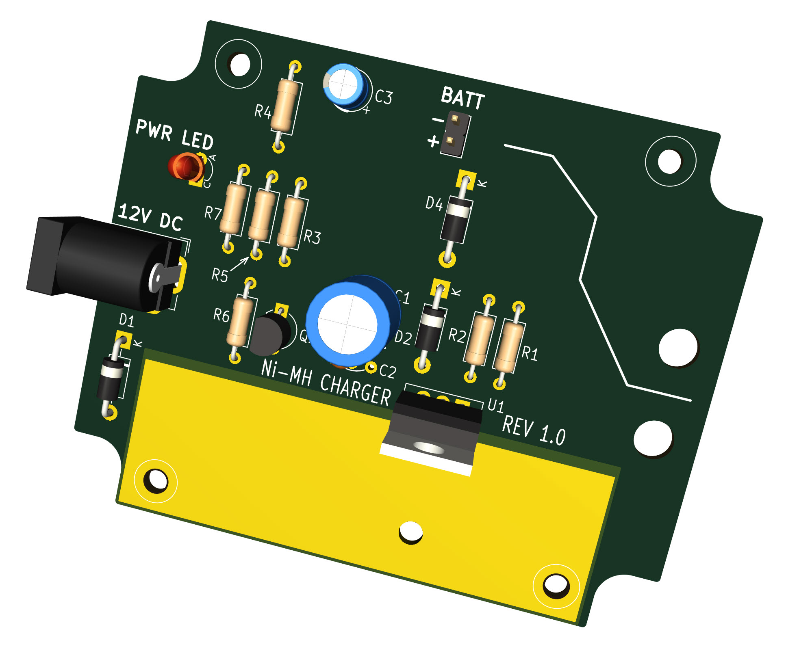

# Simple Nickel-Metal Hydride Charger

The file export-charger-gerber-rev1_0.zip contains Gerber files ready for uploading to any PCB manufacturer website, for the simple Nickel-Metal Hydride (Ni-MH) Charger.
With the default component values, the charger is suitable for 4 x AA Ni-MH battery packs, and will take approximately 20 hours to fully charge them. It is believed the charger can be left connected indefinitely to the battery pack, however, NOTE: there is NO GUARANTEE that this circuit will work correctly! Never leave batteries charging unattended or at night time.

Note: Use the Gerber zip file called export-charger-gerber-snapoff-version-rev1_0.zip if you wish to have snap-off portions to suit an AliExpress case of dimensions 90x70x28 mm. (The case is easily searchable on the AliExpress site using those dimensions in the search description). 

